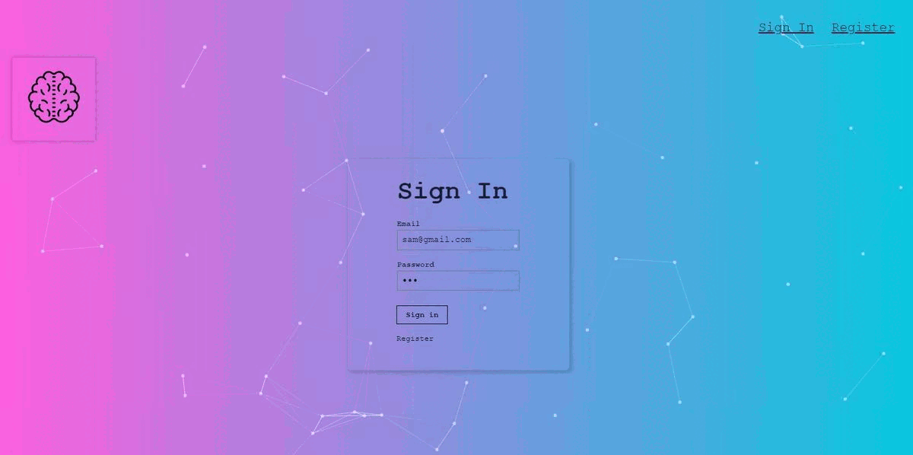

# Smart Brain AI

## Live Site
For a quick preview of the site, click the link below:
under construction

## What's inside?
What's inside this app:

- This app uses the Clarifai API to locate a face in a picture. https://www.clarifai.com
- User signin/registration using Bcrypt
- Keeping track of the number of entries for each user.
- API built with Node.js, Express.js, as well as a PosrtgreSQL.

## Framework
This app uses <a href="https://reactjs.org/" target="_blank">ReactJS</a> framework for its development.

## Technologies Used
### Front-end
- HTML5
- CSS3
- Javascript
- React
### Back-end
- Node.js
- Express.js
- RESTful API Design
- PostgresSQL
### Dependencies
- Bcrypt
- Postgresql
- knex
- cors
- express
- tackyons

## Author
- Website - [Sam Bonfanti](https://sambonfanti.club/)
- Frontend Mentor - [@CodeMaster7](https://www.frontendmentor.io/profile/CodeMaster7)
- Linkedin - [sambonfanti](https://www.linkedin.com/in/sambonfanti/)
